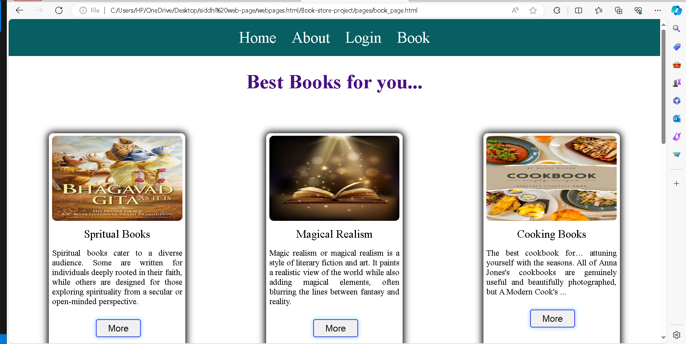
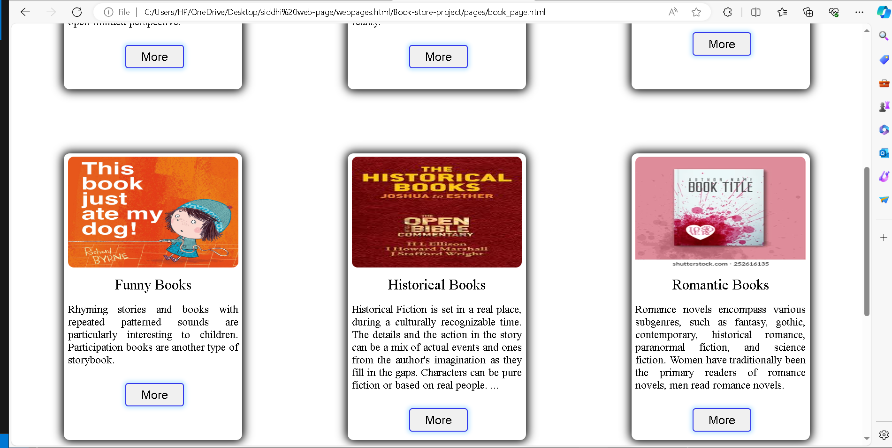

# concept:

## A bookstore is a store that sells books, and where people can buy them. A used bookstore or second-hand bookshop sells and often buys used books. Some modern bookstore combine the books (including digital books) and coffee or CDs.

~
---
# Best Books for you
 Types of Books 6 category added.

 1.Spritual Books
 2.Magical Realism
 3.Cooking Books
 4.Fuuny Books
 5.Historical Books
 6.Romantic Books

~

~
---
# How to contribute in

1.Spritual Books:
                Spiritual books cater to a diverse audience. Some are written for individuals deeply rooted in their faith, while others are designed for those exploring spirituality from a secular or open-minded perspective.

2.Magical Realism:
                 Magic realism or magical realism is a style of literary fiction and art. It paints a realistic view of the world while also adding magical elements, often blurring the lines between fantasy and reality.

3.Cooking Books:
                The best cookbook for… attuning yourself with the seasons. All of Anna Jones's cookbooks are genuinely useful and beautifully photographed, but A Modern Cook's.

 4.Fuuny Books:
              Rhyming stories and books with repeated patterned sounds are particularly interesting to children. Participation books are another type of storybook.

 5.Historical Books:
                Rhyming stories and books with repeated patterned sounds are particularly interesting to children. Participation books are another type of storybook.

 6.Romantic Books:
                  Romance novels encompass various subgenres, such as fantasy, gothic, contemporary, historical romance, paranormal fiction, and science fiction. Women have traditionally been the primary readers of romance novels, men read romance novels.

---

Made with [contrib.rocks](https://contrib.rocks).